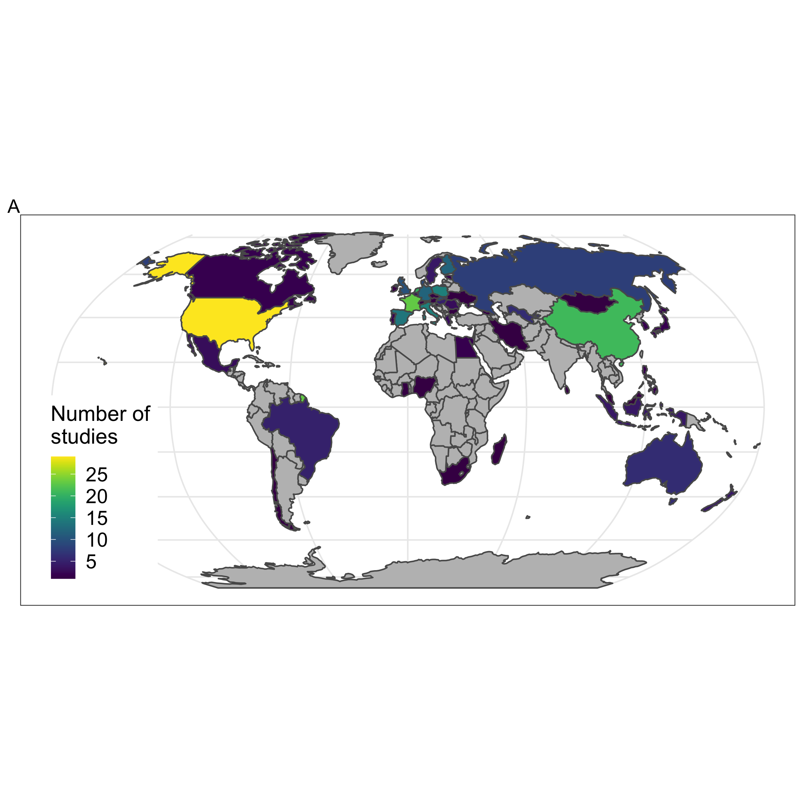

Results presented in "Soil biodiversity and chemical stressors: global review and roadmap for future research". 

Figures are created from the script "FIGURES.R".

## Data
```{r loaddat}
library(dplyr)
# load packages for maps
library(maptools)
library(ggmap)
library(rnaturalearth)
library(countrycode)
library(viridis)
library(ggplot2)
library(knitr)
library(patchwork)
library(reshape2)

`%notin%` = Negate(`%in%`)

# DATA--------
metadatreview <- read.csv("Data/References_pollution_review.csv")

```


## How many studies included?
```{r}
nrow(metadatreview)
```

# 1. Mapping knowledge gaps

## 1.1. Geographical bias

Are there geographical bias and what regions are poorly covered ?



Countries most represented? 
```{r}
stud <- metadatreview %>% 
  group_by(Country) %>% 
  summarize(no.stu = n())

multicountrystud <- stud[grepl(";|,", stud$Country),]

# Manually add multiple countries studies:
addingcountries <- data.frame(rbind(c("Brazil", 1), c("Portugal", 1), 
                                    c("Canada", 1), c("france", 1), c("The Netherlands", 1), c("Switzerland", 1),
                                    c("Germany", 1), c("The Netherlands", 1), c("UK", 1), c("Portugal", 1),
                                    c("Indonesia", 1),c("Malaysia", 1),
                                    c("UK", 1),
                                    c("The Netherlands", 1), c("Belgium", 1), c("france", 1), c("germany", 1)))
colnames(addingcountries) <- colnames(stud)
addingcountries$no.stu <- as.numeric(addingcountries$no.stu)

stud <- rbind(as.data.frame(stud), addingcountries)

# harmonize country names
stud <- stud %>%
  mutate(iso =  countrycode(stud$Country, origin = "country.name", destination = "iso3c")) %>%
  dplyr::group_by(iso) %>%
  summarize(no.stud = sum(no.stu, na.rm = TRUE))

stud[stud$no.stud > 20,]
```


## 1.2. Pollutant types

### Time span of studies? 
```{r}
summary(metadatreview$Published.Year)
```


### Pollutants most/least represented? 
```{r}
whichPollutionType <- c("Metals", "PAH", "Pesticides", "Plastics/Plasticizers","Pharmaceuticals","Radiation", "Nanoparticles", "Others")

iterations  <-  length(whichPollutionType)
variables <-  1


output <- matrix(ncol=variables, nrow=iterations)

for(i in 1:iterations){
  output[i,] <- length(grep(whichPollutionType[i], ignore.case = TRUE, as.character(metadatreview$PollutantType)))
}

output <- data.frame(PollutionType = whichPollutionType,
                     no.studies = output)

kable(output)

```

### Figure 2B - Time trends 


### What are the human activities responsible for soil pollution that are the most commonly studied ? 

```{r}
whichPollutionSource <- c("Agricultural/livestock","Industrial","Mining/Smelting","Military/Wars",                        "Natural/geogenic","Waste/Sewage","Urban/Transport","Others")

iterations  <-  length(whichPollutionSource)
variables <-  1


output <- matrix(ncol=variables, nrow=iterations)

for(i in 1:iterations){
   output[i,] <- length(grep(whichPollutionSource[i], ignore.case = TRUE, as.character(metadatreview$PollutionSource)))
}

output <- data.frame(output)
output$PollutionSource <- whichPollutionSource

kable(output)

```


```{r}
# sum up industrial/mining/waste (overlaps)
sum(output$output[output$PollutionSource=="Industrial"],
    output$output[output$PollutionSource=="Mining/Smelting"])
```


What are the "others" in Pollutant type category: 
- salts
- explosives

```{r}
metadatreview$PollutantName[metadatreview$PollutantType=="Others"]
```

### Mixture of chemicals: what scenarios studied?
```{r}
# create new pol type where = mixture when more than one category of pollutants are involved
metadatreview$PollutantType2 <- as.factor(ifelse(grepl(",", metadatreview$PollutantType), "Mixture",                                    as.character(metadatreview$PollutantType)))

summary(metadatreview$PollutantType2)
```


When accounting for mixture across AND within pollutant categories: most studies focus on multiple chemicals. Indeed, half of the studies are observational, and most contaminations and pollutions involve multiple chemicals in real-world scenarios.
```{r}
# create new pol type where = mixture when more than one category of pollutant is involved (for plot purposes)
metadatreview$PollutantType3 <-as.factor(ifelse(
  # mixtures across and within categoreis of stressors
  grepl(",|;|and|several|many|multiple|nanomaterials|metals|cides|carbons|PAHs|agents|residues", metadatreview$PollutantName)|
    grepl(",", metadatreview$PollutantType), "Mixtures", 
  as.character(metadatreview$PollutantType)))

summary(metadatreview$PollutantType3)

```


## 1.3. Taxonomic groups

### What are the taxa most represented by the studies? 

```{r}
whichTaxa <- c("Protists","Tardigrades","Rotifers","Nematodes","Enchytraeids","Acari","Collembola","Protura","Diplura","Pseudoscorpions","Ants","Termites","Isopoda","Myriapoda","Earthworms","Coleoptera","Arachnida","Gastropoda","Larvae","Others")

iterations = length(whichTaxa)
variables = 1

output <- matrix(ncol=variables, nrow=iterations)

for(i in 1:iterations){
  output[i,] <- length(grep(whichTaxa[i], ignore.case = TRUE, as.character(metadatreview$TaxaGroupAtlas)))
}

output <- data.frame(output)
output$Taxagroup <- whichTaxa
output$no.studies <- output$output
output$Taxagroup2 <- reorder(output$Taxagroup, output$output)
 

ggplot(output, aes(x = Taxagroup2, y = no.studies))+
  geom_col()+
   theme_bw() +
  theme(axis.text.y=element_text(face = "bold", size = rel(2)), 
        axis.text.x=element_text(angle = 45, hjust = 1, size = rel(2)),
        axis.title.y = element_text(size=18, face = "bold"),
        
        #legend
        legend.title = element_blank() ,
        legend.text = element_text(size=16), 
        legend.position = "bottom",
        
        #for the facets
        strip.text.x = element_text(size=16, face = "bold"),
        strip.background = element_rect(colour="black", fill="white"))

kable(output[,1:2])

```

### How many studies addressing macrofauna?

```{r}
metadatreview$Macrofaune <- factor(ifelse(grepl("Ants|Termites|Isopoda|Myriapoda|Earthworms|Coleoptera|Arachnida|Gastropoda", 
                                  ignore.case = TRUE, as.character(metadatreview$TaxaGroupAtlas)), "Macrofauna", "Not macrofauna"))

summary(metadatreview$Macrofaune)
```

### Figure 2C - alluvial diagram


# 2. Ecosystem perspective

What is the scope of studies on chemical stressors impacts on natural soil fauna communities?

## Figure 3- Scope of research


## 2.1. Multitrophic biodiversity and foodwebs

### How many soil fauna taxonomic groups per study?
```{r}
# count the no. of commas in the list
# subset dataframe keeping only paperID and drivers
df_taxo <- subset(metadatreview, select = c(X, TaxaGroupAtlas))

# split multiple taxa and pollutants into separate rows with strsplit
new_df_taxolist <- strsplit(as.character(df_taxo$TaxaGroupAtlas), ',')
new_df_combi_taxa <- data.frame(
  TaxaGroupAtlas = unlist(new_df_taxolist),
  PaperID = rep(df_taxo$X, sapply(new_df_taxolist, FUN = length)))

# no. of taxo group per paper
new_df_counts <- new_df_combi_taxa %>% group_by(PaperID) %>% summarise(no.taxa = n())

# descriptive stats
summary(new_df_counts)
hist(new_df_counts$no.taxa)
table(new_df_counts$no.taxa)

# Calculate the percentage of each group
new_df_counts <- new_df_counts %>%
  group_by(no.taxa) %>%
  summarise(no.studies = n(), Percent = n()/nrow(.) * 100)

kable(new_df_counts)


```

### Foodweb mentioned in the abstract? 

Search the abstracts of the studies for foodweb, food-web, trophic: 4 papers have foodweb in the abstract, only one paper has it in the title, 43 have trophic in the abstract (nematodes), 2 in the title.

```{r}

# number of papers with those keywords in the abstract
whichKeywords <- c("foodweb|food-web")


iterations = length(whichKeywords)
variables = 1

output <- matrix(ncol=variables, nrow=iterations)

for(i in 1:iterations){
  output[i,] <- length(grep(whichKeywords[i], ignore.case = TRUE, as.character(metadatreview$abstract)))
}

output <- data.frame(output)
output$Keyword <- whichKeywords
output

# number of papers with those keywords in the title
whichKeywords <- c("foodweb|food-web", "trophic")


iterations = length(whichKeywords)
variables = 1

output2 <- matrix(ncol=variables, nrow=iterations)

for(i in 1:iterations){
  output2[i,] <- length(grep(whichKeywords[i], ignore.case = TRUE, as.character(metadatreview$title)))
}

output2 <- data.frame(output2)
output2$Keyword <- whichKeywords
output2

```


### What aspect of fauna diversity did the studies measured?
```{r}
whichDiv <- c("Abundance","Biomass","Richness","Shannon","Evenness", "Others")

iterations = length(whichDiv)
variables = 1

output <- matrix(ncol=variables, nrow=iterations)

for(i in 1:iterations){
  output[i,] <- length(grep(whichDiv[i], ignore.case = TRUE, as.character(metadatreview$DiversityMetric)))
}

output <- data.frame(output)
output$Measurement <- whichDiv

output
```


### Multitrophic-diversity: how often other groups were studied ?
```{r}
metadatreview <- metadatreview %>% 
  mutate(OtherBiodiversity = factor(ifelse(OtherBiodiversity=="lichens", "plants", # lichens in the plant category for simplification
                                           as.character(OtherBiodiversity))))

# Calculate the percentage of each group
metadatreviewsummary <- metadatreview %>%
  group_by(OtherBiodiversity) %>%
  summarise(no.studies = n(), Percent = n()/nrow(.) * 100)

kable(metadatreviewsummary)
```


## 2.2. Ecosystem functioning

### Proportion of studies addressing one or several functions?
```{r}
# Calculate the percentage of studies that have no,, one or several functions (based on full text screening)
metadatreviewsummary2 <- metadatreview %>%
  group_by(EcosystemFunction) %>%
  summarise(n(), Percent = n()/nrow(.) * 100)

kable(metadatreviewsummary2)
```


```{r}
# how many papers have function in the abstract?
subsetEF <- metadatreview[grepl("function", metadatreview$abstract),]
nrow(subsetEF)

# removing "functional groups" (nematodes studies often reported this)
nrow(subsetEF[!grepl("functional", subsetEF$abstract),])
```


## 2.3. Multiple global drivers

### How often studies considered other drivers of global change?
```{r}
# create the multiple stressors var
metadatreview <- metadatreview %>% 
  mutate(Multistressors = factor(ifelse(grepl(",", PollutantType), "Multiple stressors", 
                                        "Single stressor")),
         Multidrivers = factor(ifelse(LandUse=="TRUE"|Intensification=="TRUE"|Fragmentation.Loss=="TRUE"|Nutrient=="TRUE"|ClimateChange=="TRUE"|Invasives=="TRUE", "yes", "no")))

# Calculate the percentage of each group
metadatreviewsummary3 <- metadatreview %>%
  group_by(Multidrivers) %>%
  summarise(no.studies = n(), Percent = n()/nrow(.) * 100)

```


### Drivers considered
```{r}

# create the list of vector each corresponding to a separate circle
multiGCDpapers <- data.frame(no.stu = t(
  data.frame(
    withLUI = nrow(metadatreview[metadatreview$Intensification == "TRUE", ]),
    withLUC = nrow(metadatreview[metadatreview$LandUse == "TRUE", ]),
    withInvas = nrow(metadatreview[metadatreview$Invasives == "TRUE", ]),
    withClim = nrow(metadatreview[metadatreview$ClimateChange == "TRUE", ]),
    withNut = nrow(metadatreview[metadatreview$Nutrient == "TRUE", ]),
    withFragm = nrow(metadatreview[metadatreview$Fragmentation.Loss == "TRUE", ])
  )
))

multiGCDpapers$OtherDrivers <- rownames(multiGCDpapers)

kable(multiGCDpapers)


```


## Study types - experimental or observational?

```{r}
summary(metadatreview$ExperimentObservation)
```


## What types of ecosystems/land covers are represented? 
```{r}
whichSystem <- c("Grassland","Woodland","Cropland","Wetland","Artifical","Bare land","Shrubland","Others")

iterations = length(whichSystem)
variables = 1

output <- matrix(ncol=variables, nrow=iterations)

for(i in 1:iterations){
  output[i,] <- length(grep(whichSystem[i], ignore.case = TRUE, as.character(metadatreview$System)))
}

output <- data.frame(output)
output$System <- whichSystem
output$no.studies <- output$output
output$System2 <- reorder(output$System, output$output)
 


ggplot(output, aes(x = System2, y = no.studies))+
  geom_col()+
   theme_bw() +
  theme(axis.text.y=element_text(face = "bold", size = rel(2)), 
        axis.text.x=element_text(angle = 45, hjust = 1, size = rel(2)),
        axis.title.y = element_text(size=18, face = "bold"),
        
        #legend
        legend.title = element_blank() ,
        legend.text = element_text(size=16), 
        legend.position = "bottom",
        
        #for the facets
        strip.text.x = element_text(size=16, face = "bold"),
        strip.background = element_rect(colour="black", fill="white"))


```


### Citations of papers that addressed bioindicators

```{r}

# # 22 studies have bioindicator in the abstract
whichKeywords <- c("bioindicator|bio-indicator")


iterations = length(whichKeywords)
variables = 1

output <- matrix(ncol=variables, nrow=iterations)

for(i in 1:iterations){
  output[i,] <- length(grep(whichKeywords[i], ignore.case = TRUE, as.character(metadatreview$abstract)))
}

output <- data.frame(output)
output$Keyword <- whichKeywords
output

# list those papers
BioIndicStudiesAbstract <- metadatreview[grepl("bioindicator", metadatreview$abstract),]
BioIndicStudiesTitle <- metadatreview[grepl("bioindicator", metadatreview$title),]
BioIndicStudiesTitle
```


## Supplement Tables

### Supplement Table: all papers with multitrophic-diversity

The list of papers focusing on plants, microbes and soil fauna was used to investigate whether the studies addressed indirect effects of chemical stressors, and if they considered foodweb or network approaches. 

```{r}
# create a table with all studies that have at least one EF
WhichVars <- c("authors", "Published.Year", "journal", "title", "DOI", "Country", "DiversityMetric", "PollutantName", "PollutantType", "PollutionSource", "TaxaGroupAtlas", "System", "OtherBiodiversity", "EcosystemFunction", "Multidrivers")

MBdata <- metadatreview[metadatreview$OtherBiodiversity != "no",WhichVars]


write.csv(MBdata, "Output/TablePapersWithMultiDiv.csv")
```

### Supplement Table: all papers with functions

The list of papers having at least one function was used to investigate what type of functions and ecosystem services were addressed in those studies.

```{r}
# create a table with all studies that have at least one EF
WhichVars <- c("authors", "Published.Year", "journal", "title", "DOI", "Country", "DiversityMetric", "PollutantName", "PollutantType", "PollutionSource", "TaxaGroupAtlas", "System", "OtherBiodiversity", "EcosystemFunction", "Multidrivers")

EFdata <- metadatreview[metadatreview$EcosystemFunction != "none",WhichVars]


write.csv(EFdata, "Output/TablePapersWithEF.csv")
```

### Supplement Table: all papers with multi-drivers

The list of papers having multiple global change drivers was used to investigate how often studies had a full factorial design enabling to address interactive effects. 

```{r}
WhichVars <- c("authors", "Published.Year", "journal", "title", "DOI", "Country", "DiversityMetric", "PollutantName", "PollutantType", "PollutionSource", "TaxaGroupAtlas", "System", "OtherBiodiversity", "EcosystemFunction", "Multidrivers",
               "ClimateChange", "Nutrient", "LandUse",
               "Intensification", "Fragmentation.Loss", "Invasives")

MultiGCDdata <- metadatreview[metadatreview$Multidrivers != "no",WhichVars]


write.csv(MultiGCDdata, "Output/TablePapersWithMultiGCDs.csv")
```
